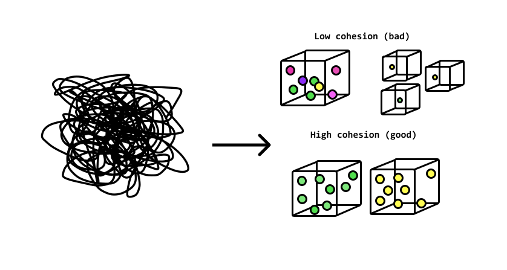
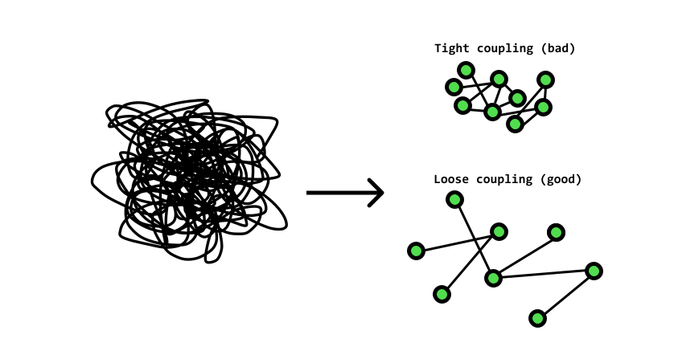
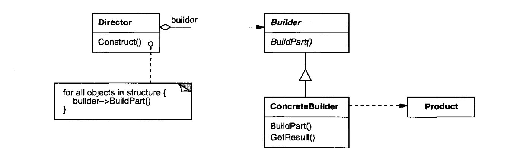
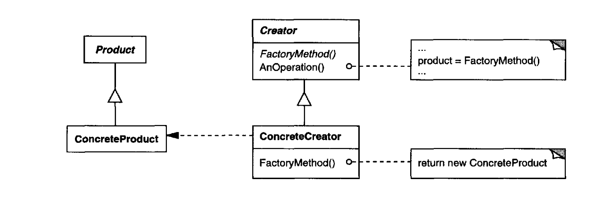
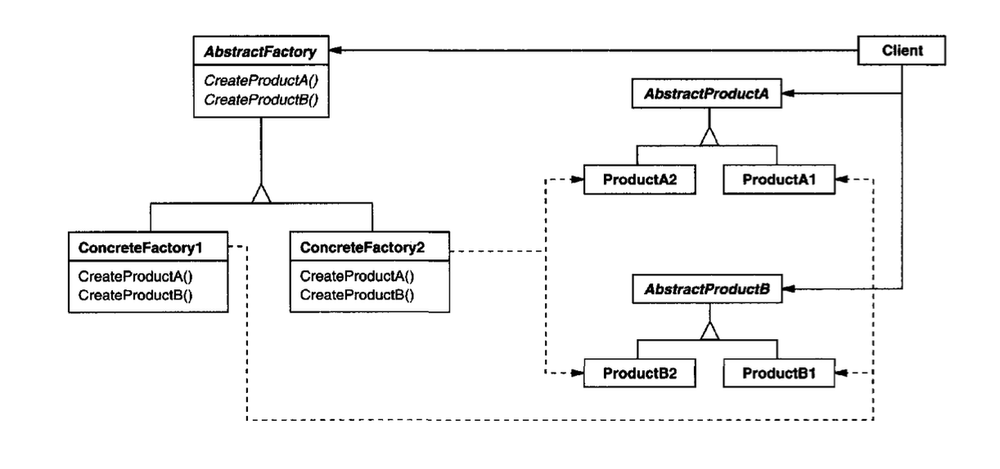
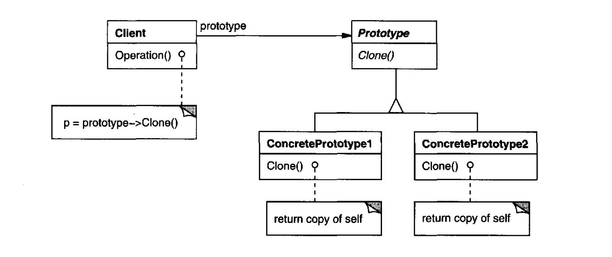
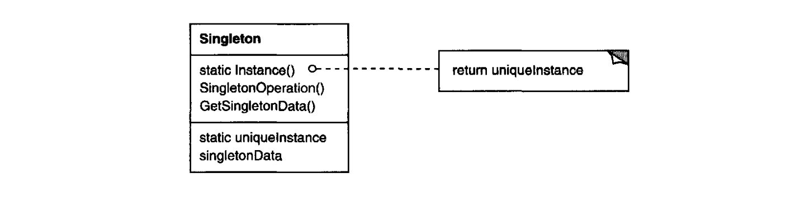

# Design Pattern

***

## SOLID

### Single Responsibility Principle

* Every software component should have one and **only one responsibility / reason to change**
* Group the responsibilities in a sensible way
* Cohesion
  * The degree to which the various parts of a software component are related
  * Example of garbage classification
  * Aim for high cohesion
  * 
* Coupling
  * The level of inter dependency between various software components
  * Aim for loose coupling
  * 

* Changes are inevitable, so we need **Higher Cohesion and Loose Coupling**


### Open-Closed Principle

* Software components should be **closed for modification**, but **open for extension**
* New features getting added to the software component should NOT have to modify existing code
* A software component should be extendable to add a new feature or to add a new behavior to it
* Example of PS5 remote control and accessories
* **Key philosophy: one interface, different implementations**
  * Avoid modifying base class, derive from base and override methods
* Open closed principle often requires decoupling

### Liskov Substitution Principle

* Objects should be replacable with their subtypes without effecting the correctness of the program
* Derived classes must be usable through the base class interface, without the need for the user to know the difference
* **It is violated when child class completely modifies the behaviour of the base class method by overriding it**
* Change the way of "IS-A" thinking in the real world
  * E.g. `Square` should NOT be a subclass of `Rectangle`
* Two way of applying LSP
  * Break the hierarchy if it fails the substitution test
  * Use an interface
* Most of time using `instanceof` indicates an issue

### Interface Segregation Principle

* No client should be forced to depend on methods it does not use
* **Minimize the interface**
* Work with SRP and LSP
* Design first, try not to extract interface afterwards

### Dependency Inversion Principle

* High-level modules (business logics) should not depend on the low-level modules (functionalities). Both should depend on abstractions

* Abstractions should not depend on details. Details should depend on abstractions

  * **Instead of instantiating dependencies ourselves, let somebody else gives us the dependencies**

  * ```java
    // From this
    public void writeReport(Report r) {
      JSONFormatter f = new JSONFormatter();
      String report = f.format(r);
      FileWriter w = new FileWriter("report.json");
      w.write(report);
    }
    
    // To this
    public void writeReport(Report r, Formatter f, Writer w) {
      String report = f.format(r);
      w.write(report);
    }
    ```

***

## Creation Design Patterns

* Creational patterns concern the process of object creation

* The problem: **Hard-coding the classes that get instantiated** (`new`)

  *  Aim to hide the concrete product classes from the client, thereby reducing the number of names clients know about

  > *Programming to an interface, not an implementation*

### Builder

* Encapsulate the construction of a product and allow it to be constructed **in steps**
* 
* When to use?
  * Several flavors of an object may be asked for
  * There are a lot of steps involved in creation of an object
  * Avoid to have too many parameters in the constructor
  * **Often used for building Composite**
* How to use?
  * The client creates the Director object and configures it with the desired Builder object, or the client play the role of Director
  * Director notifies the builder whenever a part of the product should be built
  * Builder handles requests from the director and adds parts to the product
  * The client retrieves the product from the builder
* In real world
  * Optionally Builder can keep reference to a Product that it has built so the same Product can be returned in the future
  * It is common to put the Builder as an inner class inside the Product
    * Setters are `private` to achieve **immutability**
  * The Director is rarely implemented as a separate class
  * Abstract Builder is not required if Product is not part of any inheritance hierarchy
  * The methods in Builder often support *method chaining*
* Examples
  * `StringBuilder`, `StringBuffer`
  * `java.util.Calendar.Builder`
* Pitfalls
  * Possibility of partially initialized object. If required properties are missing, `build()` method should provide suitable default values or throw an exception

### Factory Method

* Define an interface for creating an object, but let subclasses **decide** which class to instantiate. Factory Method lets a class **defer** instantiation to subclasses
* 
  * **Parallel class hierarchy**
* When to use?
  * A class can't anticipate the class of objects it must create
  * A class wants its subclasses to specify the objects it creates
  * Classes delegate responsibility to one of several helper subclasses, and you want to localize the knowledge of which helper subclass is the delegate
* How to use?
  * Creator relies on its subclasses to define the factory method so that it returns an instance of the appropriate ConcreteProduct
* In real world
  * The Creator can be a concrete class and provide a default implementation of factory method
  * The factory method not only instantiates the ConcreteProduct, but can also perform additional operations
* Examples
  * `iterator()` method in `java.util.AbstractCollection`
* Pitfalls
  * It forces you to subclass the Creator class just to create a particular ConcreteProduct object
* Simple Factory Method
  * It isn't a design pattern, it is a programming idiom
  * Move the instantiation logic to a separate class and most commonly to a static method of this class
    * Applying the Dependency Inversion Principle
  * Typically used if we have more than one option when instantiating the object and a simple logic is used to decide the correct class (`switch` block)
    * "*Parameterized factory method*"
    * **No inheritance compared to Factory Method** (Just a ConcreteCreator)

### Abstract Factory

* Provide an interface for creating families of related or dependent objects (a **kit**) without specifying their concrete classes
* 
  * **Like a bundle of Factory Methods**
* When to use?
  * A family of related Product objects is designed to be used together
* How to use?
  * Normally a single instance of a ConcreteFactory class is created at run-time. This concrete factory creates product objects having a particular implementation. To create different product objects, clients should use a different concrete factory
* In real world
  * A concrete factory is often a singleton
  * AbstractFactory classes are often implemented with factory methods, but they can also be implemented using Prototype
* Examples
* Pitfalls
  * Extending abstract factories to produce new sets of Products requires changing the AbstractFactory class and all of its subclasses
  * Difficult to realise the need at the start of the development and usually starts out as a Factory Method

### Prototype

* Specify the kinds of objects to create using a prototypical instance, and create new objects by copying this prototype
* 
* When to use?
  * When instances of a class can have one of only a few different combinations of state
  * We have a complex object that is costly to create
  * To avoid building a class hierarchy of factories that parallels the class hierarchy of products
* How to use?
  * A client asks a prototype to clone itself
* In real world
  * Pay attention to the choice of shallow copy or deep copy
  * Reset the state of the object  before returning the prototype
  * A prototype registry can solve the problem of getting the initial instances
* Examples
  * In Java this typically means using the `clone()` method, or de-serialization when you need deep copies
* Pitfalls
  * An object whose states are largely mutable objects is complicated to clone

### Singleton

* Ensure a class only has one instance, and provide a global point of access to it

* 

* When to use?

  * There must be exactly one instance of a class, and it must be accessible to clients from a well-known access point

* How to use?

  * Class constructors must be `private`

  * Class itself keeps the instance, and gives access to it

  * Eager Singleton

    * Create singleton as soon as the class is loaded

    * ```java
      class Singleton {
        private static Singleton uniqueInstance = new Singleton();
        private Singleton() {}
        public static Singleton getInstance() {
          return uniqueInstance;
        }
      }
      ```

  * Lazy Singleton

    * Singleton is created when it is required the first time

    * ```java
      // Double-checked locking
      class Singleton {
        private volatile static Singleton uniqueInstance;
        private Singleton() {}
        public static Singleton getInstance() {
          if (uniqueInstance == null) {
            synchronized (Singleton.class) {
              if (uniqueInstance == null) {
                uniqueInstance = new Singleton();
              }
            }
          }
          return uniqueInstance;
        }
      }
      
      // Initialisation holder
      class Singleton {
        private static class UniqueInstanceHolder {
          static Singleton uniqueInstance = new Singleton();
        }
        public static Singleton getInstance() {
          return UniqueInstanceHolder.uniqueInstance;
        }
      }
      ```

* In real world

  * `getInstance()` should not expect any arguments
  * Make sure your singletons are not carrying a lot of mutable global states
  * There are very few situation where a Singleton is a good choice

* Examples

  * `java.lang.Runtime`
  * Application configuration
  * Logging frameworks
  * Spring framework treats all beans by default Singletons

* Pitfalls

  * Lazy Singleton may cause concurrency issues (more than one instances are created by different threads)
  * Singleton can deceive you about the true dependency
  * Singleton in Java is held per class loader not per JVM, so they may not be the true singleton in web applications
  * Nowadays, singleton is considered as a bad design practice

***

## Structural Design Patterns

* Structural patterns deal with the composition of classes or objects

***

## Behavioural Design Patterns

* Behavioral patterns characterize the ways in which classes or objects interact and distribute responsibility

***

## References

* https://java-design-patterns.com/patterns/